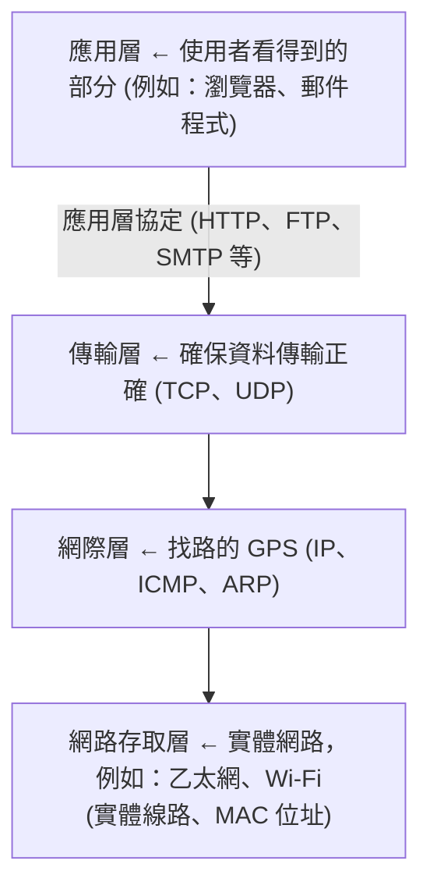
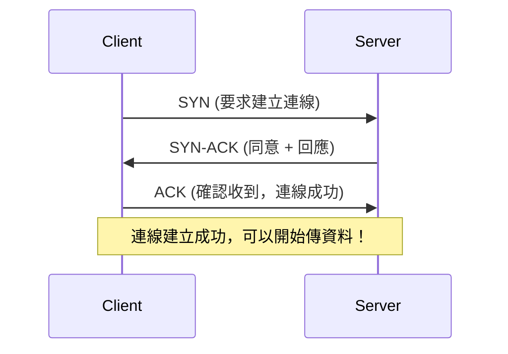
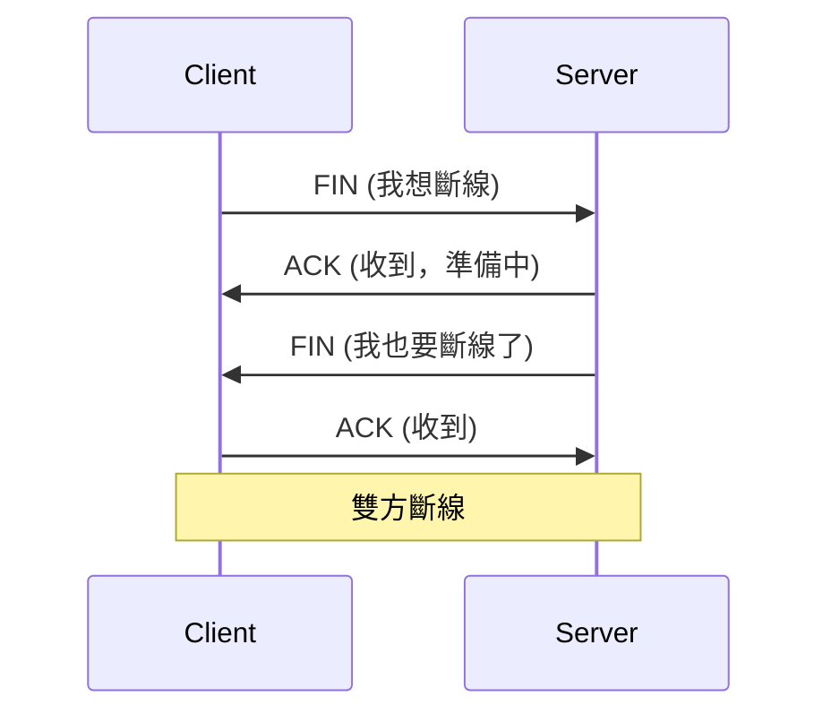

# TCP/IP

在網路世界中，瀏覽網頁、收發電子郵件、觀看串流影片等各種應用，背後其實都是透過 TCP/IP 協定 來實現資料的傳輸與溝通。

TCP/IP 全名為 Transmission Control Protocol/Internet Protocol (傳輸控制協定/網際網路協定)，是一組通訊協定的總稱，用來規範電腦之間如何在網路上互相溝通與傳送資料。

簡單來說，TCP/IP 就像是一種「通用語言」，讓不同品牌、不同系統的電腦裝置都能在全球網路上互相理解並交換資訊。

📌 注意：雖然常說「TCP/IP 協定」，其實並不是單一協定，而是一整個協定架構 (Protocol Suite)，包括多個層級與子協定。

 

## TCP/IP 四層模型

TCP/IP 架構可分為四層，每一層都有其負責的任務

1. 應用層 (Application Layer)

    - 功能：提供使用者直接使用的應用程式，例如：網頁、電子郵件、FTP 等。

    - 常見協定：

        - HTTP/HTTPS：網頁瀏覽

        - SMTP/POP3/IMAP：電子郵件

        - FTP：檔案傳輸

2. 傳輸層 (Transport Layer)

    - 功能：負責資料的可靠傳輸與錯誤控制。

    - 核心協定：

        - TCP (Transmission Control Protocol)

            - 連線導向 (Connection-oriented)

            - 確保資料正確、順序到達

        - UDP (User Datagram Protocol)

            - 非連線導向 (Connectionless)

            - 傳輸速度快，但不保證正確性 (例如：線上遊戲、影音串流)

3. 網際層 (Internet Layer)

    - 功能：負責資料在不同網路之間的傳送與路由選擇。

    - 核心協定：

        - IP (Internet Protocol)

            - 負責分割資料封包與定址 (IP 位址)

            - 不保證資料的正確送達

        - ICMP (Internet Control Message Protocol)

            - 用於錯誤回報與診斷 (例如：ping 命令)

4. 網路存取層 (Network Access Layer)

    - 功能：處理實體網路介面的資料傳送，例如：網卡與交換器之間的資料傳輸。

    - 協定範例：Ethernet (乙太網)、Wi-Fi、PPP 等。

### TCP/IP 四層架構示意圖

 

## TCP 資料傳送流程圖 (三次握手 & 四次揮手)

### 三次握手 (建立連線)

### 四次揮手 (斷開連線)

 

## TCP 與 IP 的角色與差異

雖然 TCP 和 IP 常常一起提起，但其實各自扮演不同角色

| 協定 | 角色 | 功能說明 |
| - | - | - |
| IP | 地址與傳遞 | 負責將資料從來源主機送到目的主機 (就像郵差一樣) |
| TCP | 傳輸控制 | 	負責資料的正確分段、排序與確認 (就像把信封封好並確認送達) |

TCP/IP 就像是這兩個協定合作完成的運輸任務：IP 決定路線，TCP 確保貨物完整安全送到。

 

## 實際應用

| 應用 | 使用協定 |
| - | - |
| 瀏覽網頁 | HTTP/HTTPS (使用 TCP) |
| 看 YouTube、直播 | RTP/UDP |
| 線上遊戲 | UDP (因為速度比正確性更重要) |
| 傳送 Email | SMTP、IMAP (使用 TCP) |
| 遠端登入 | SSH (使用 TCP) |

 

## TCP/IP 的重要性

- 通用性強：幾乎所有作業系統與裝置都支援 TCP/IP。

- 跨平台：不管是 Windows、macOS、Linux、iOS、Android 都可溝通。

- 穩定可靠：尤其是 TCP，適用於需要穩定連線的應用 (例如：網頁、銀行交易)。

- 擴充性好：能適應從小型區域網路到全球網路 (例如：網際網路)。

 

## TCP/IP 的簡單比喻

TCP/IP 像是寄信

| 對照概念 | 比喻說明 |
| - | - |
| IP 協定 | 像是信封上的地址，決定送去哪裡 |
| TCP 協定 | 像是郵差確認每封信都送達無誤 |
| 封包 (Packet) | 一封封信件 |
| 應用層協定 | 寄信內容的格式 (例如：HTML、圖片等) 

### 簡單例子

用瀏覽器 (Chrome) 輸入 `https://www.google.com`

1. 應用層：發出 HTTPS 請求。

2. 傳輸層：使用 TCP，將請求打包成資料封包。

3. 網際層：使用 IP，封包貼上 Google 的 IP 地址。

4. 網路層：從 Wi-Fi 傳到路由器 → ISP → Google 的伺服器。

5. 回傳時同樣流程反過來回來。

### 用生活的方式比喻

想像一封信從 A 寄到 B：

1. 你 (Client) 想傳送資料：寫好信 (資料)

2. 貼上對方地址 (IP)

3. 請郵差來收件 (三次握手)

4. 郵差確認收件後寄出 (TCP 傳輸)

5. 收件人回信 (伺服器回應)

6. 通訊結束後你說「我要斷線」，對方說「我也斷線」 (四次揮手)

這整個過程中，TCP/IP 就像是跨國郵政系統一樣協助信件來回、安全送達。

 

## 總結

TCP/IP 是現代網路的基石。無論是手機、電腦，甚至是家裡的智慧家電，只要能連上網路，就幾乎一定是在使用 TCP/IP。在學習網路、從事軟體開發或系統管理時，理解這套協定架構是不可或缺的基本功。

若對網路架構或安全有進一步興趣，建議可以接著深入學習 OSI 七層模型、DNS、NAT、IPV4/IPV6 等相關概念。
