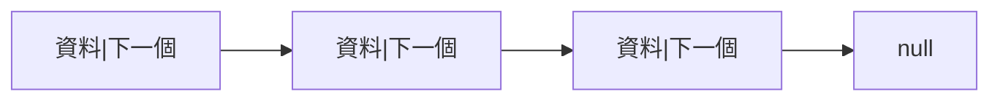

# 鏈結串列 (Linked List)

在資料結構 (Data Structure) 中，鏈結串列 (Linked List) 是一種非常重要的基礎結構，提供了與陣列 (Array) 不同的儲存方式，特別適合在需要頻繁插入或刪除資料的情境下使用。

鏈結串列是一種線性資料結構 (Linear Data Structure)，由許多節點 (Node) 所組成。

- 每個節點 (Node) 至少包含兩個部分：

    - 資料 (Data)：節點存放的值，例如：數字、字串或物件。

    - 指標 (Pointer 或 Reference)：指向下一個節點的位址 (在 C、C++ 這類語言稱為指標，在 JavaScript、Java、Python 等語言中通常是參考 Reference)。

- 透過這些指標，節點會「串」起來，形成一條「鏈」狀結構，因此被稱為鏈結串列 (Linked List)。

### 示意圖



(`null` 表示鏈結串列的尾端，沒有下一個節點了)

<br />

## 鏈結串列的種類

1. 單向鏈結串列 (Singly Linked List)

    - 每個節點只有一個指標，指向下一個節點。

    - 遍歷 (Traversal) 只能從頭到尾，不能倒著走。

    範例

    ```mermaid
    graph LR
    head --> A --> B --> C --> null
    ```

2. 雙向鏈結串列 (Doubly Linked List)

    - 每個節點有兩個指標：

        - `prev` (前一個節點)

        - `next` (下一個節點)

    - 可以雙向遍歷 (從頭到尾或從尾到頭)

    範例

    ```mermaid
    graph LR
	  A <--> B <--> C
	  A --> null
	  C --> null
    ```

3. 循環鏈結串列 (Circular Linked List)

    - 最後一個節點的 `next` 不再是 `null`，而是指回第一個節點，形成一個「圈」。

    - 可以搭配「單向」或「雙向」的概念。

    範例(單向循環)：

    ```mermaid
	graph LR
	A --> B --> C
	C --> A
    ```

<br />

## 鏈結串列的主要操作

鏈結串列雖然結構較複雜，但提供了一些高效的操作，特別是插入 (Insert) 與刪除 (Delete)：

- 插入 (Insertion)

    - 可以在頭部 (Head) 插入新節點 (時間複雜度 $O(1)$)。

    - 也可以在中間或尾端插入 ($O(n)$，需要先遍歷找到位置)。

- 刪除 (Deletion)

    - 可以快速刪除頭部節點 ($O(1)$)。

    - 刪除中間或尾端節點時，需要先找到前一個節點 ($O(n)$)。

- 搜尋 (Search)

    - 必須從頭開始一個一個找 ($O(n)$)。

    - 相比陣列 (Array) 的隨機存取 (Random Access)，鏈結串列在搜尋效率上比較差。

- 遍歷 (Traversal)

    - 從 head 一路走到尾端 (單向鏈結串列只能往後走，雙向鏈結串列可以往回走)。

<br />

## 範例

### JavaScript：Singly Linked List

```javascript
/** 節點 (Node) 類別 */
class Node {
  constructor(value) {
    this.value = value; // 資料
    this.next = null;   // 指向下一個節點
  }
}

/** 鏈結串列 (LinkedList) 類別 */
class LinkedList {
  constructor() {
    this.head = null; // 串列的起點
  }

  /** 在頭部插入新節點 O(1) */
  insertAtHead(value) {
    const newNode = new Node(value);
    newNode.next = this.head;
    this.head = newNode;
  }

  /** 在尾端插入新節點 O(n) */
  insertAtTail(value) {
    const newNode = new Node(value);
    if (!this.head) {
      this.head = newNode;
      return;
    }
    let current = this.head;
    while (current.next) {
      current = current.next;
    }
    current.next = newNode;
  }

  /** 刪除第一個出現的節點 O(n) */
  delete(value) {
    if (!this.head) return;

    /** 若刪的是頭節點 */
    if (this.head.value === value) {
      this.head = this.head.next;
      return;
    }

    let current = this.head;
    while (current.next && current.next.value !== value) {
      current = current.next;
    }

    if (current.next) {
      current.next = current.next.next;
    }
  }

  /** 遍歷列印 O(n) */
  print() {
    let current = this.head;
    let result = '';
    while (current) {
	  result += current.value + ' → ';
	  current = current.next;
    }
    console.log(result + 'null');
  }
}

// 測試
const list = new LinkedList();
list.insertAtHead(10);
list.insertAtHead(5);
list.insertAtTail(20);
list.insertAtTail(30);
list.print(); // 5 → 10 → 20 → 30 → null

list.delete(20);
list.print(); // 5 → 10 → 30 → null
```

### Python：Singly Linked List

```python
# 節點 (Node) 類別
class Node:
    def __init__(self, value):
        self.value = value # 資料
        self.next = None   # 指向下一個節點

# 鏈結串列 (LinkedList) 類別
class LinkedList:
    def __init__(self):
        self.head = None # 串列的起點

    # 在頭部插入新節點 O(1)
    def insert_at_head(self, value):
        new_node = Node(value)
        new_node.next = self.head
        self.head = new_node

    # 在尾端插入新節點 O(n)
    def insert_at_tail(self, value):
        new_node = Node(value)
        if not self.head:
            self.head = new_node
            return
        current = self.head
        while current.next:
            current = current.next
        current.next = new_node

    # 刪除第一個出現的節點 O(n)
    def delete(self, value):
        if not self.head:
            return

        # 若刪的是頭節點
        if self.head.value == value:
            self.head = self.head.next
            return

        current = self.head
        while current.next and current.next.value != value:
            current = current.next

        if current.next:
            current.next = current.next.next

    # 遍歷列印 O(n)
    def print_list(self):
        current = self.head
        result = ""
        while current:
            result += str(current.value) + " → "
            current = current.next
        print(result + "null")

# 測試
list_py = LinkedList()
list_py.insert_at_head(10)
list_py.insert_at_head(5)
list_py.insert_at_tail(20)
list_py.insert_at_tail(30)
list_py.print_list() # 5 → 10 → 20 → 30 → null

list_py.delete(20)
list_py.print_list() # 5 → 10 → 30 → null
```

<br />

## 鏈結串列 vs 陣列

| 特性 | 鏈結串列 (Linked List) | 陣列 (Array) |
| - | - | - |
| 記憶體配置 | 動態分配 (節點可分散) | 連續記憶體 (固定大小或動態調整) |
| 插入/刪除 | $O(1)$(頭部)/$O(n)$(中間) | $O(n)$ (需要搬移元素) |
| 存取元素 | $O(n)$ (必須從頭走到該節點) | $O(1)$ (可直接透過索引存取) |
| 應用場景 | 資料數量常變、頻繁插入刪除 | 資料大小穩定、需要快速隨機存取 |

- 若需要快速隨機存取 (例如：根據索引快速找到第 100 筆資料) → 用陣列 (Array)。

- 若需要頻繁插入或刪除 (例如：實作 Queue、Stack、LRU Cache) → 用鏈結串列 (Linked List)。

<br />

## 鏈結串列的常見用途

- 實作其他資料結構：像是堆疊 (Stack)、佇列 (Queue)、Deque。

- LRU Cache (最近最少使用快取)：雙向鏈結串列搭配哈希表使用。

- 音樂播放列表、圖片輪播 (使用循環鏈結串列)。

- 動態記憶體分配 (Memory Management)：像作業系統裡的 Free List。

<br />

## 鏈結串列的缺點

- 額外的記憶體開銷：每個節點都要存指標 (Pointer)。

- 存取效率較低：無法像陣列一樣透過索引 $O(1)$ 取得元素。

- Cache 效率差：因為節點分散在記憶體，不像陣列是連續記憶體，CPU 快取利用率低。

<br />

## 總結

鏈結串列 (Linked List) 是一種靈活的資料結構，特別適合在插入、刪除操作頻繁的情境中使用。

### 核心觀念：

- 由許多節點 (Node) 組成，每個節點指向下一個節點。

- 有單向、雙向、循環等不同形式。

- 在插入/刪除上表現優異，但在搜尋/存取上相對不方便。
